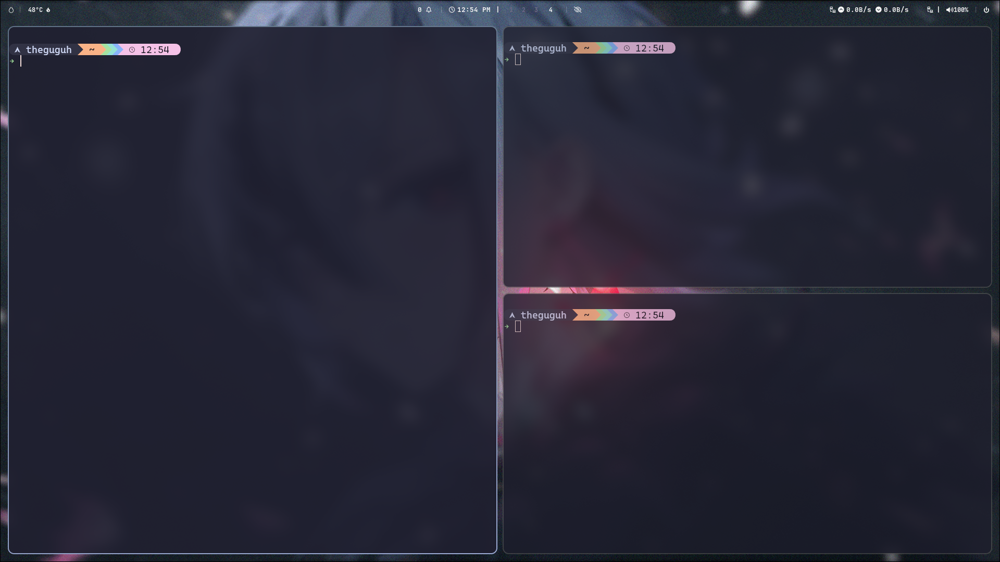

# Arch + Hyprland Setup

Welcome to my personal **Arch Linux + Hyprland** setup! 🎉  
This configuration is tailored for desktop environments and includes applications for **programming**, **gaming**, and **general use**, alongside a fully customized **Hyprland** setup.

> ⚠️ Note: This setup is primarily designed for desktop systems. While it may work on laptops, some adjustments might be necessary for some laptops features.

---

## 📸 Previews

Here are some previews of the setup in action:

### Desktop Overview


### Terminal in Action


---

## 🚀 Installation

### For New Arch Linux Installations

This setup is optimized for fresh **Arch Linux** installations. It automates the configuration of **Hyprland**, applications, and system tweaks.  
To simplify installation, I recommend using the `archinstall` script and selecting **Hyprland** as your window manager.

Run the following commands to clone and execute the setup script (on `~/` folder):

```bash
git clone https://github.com/TheGuguH/ArchHyprland-Setup.git
cd ArchHyprland-Setup
chmod +x ./install.sh
sudo ./install.sh
```

To change the wallpaper, go to `~/user/wallpaper` folder (after installation) and change the wallpaper.jpg image. To change the profile photo, go to `~/user` folder and change profile.png image.

---

### For Existing Installations or Non-Arch Systems

If you already have **Hyprland** installed, or if you're using a different Linux distribution, you can execute specific scripts for parts of the setup.  
For example, to apply only the Hyprland configuration:

```bash
cd ArchHyprland-Setup/hyprland
./setup_hyprland.sh
```

---

## 📂 Repository Structure

This repository is organized into sections to keep everything modular and easy to use:

```
ArchHyprland-Setup/
├── hyprland/                       # Hyprland-specific configuration
│   ├── config/                     # Hyprland dotfiles
│   ├── setup_hyprland.sh           # Hyprland setup script
│   └── README.md                   # Instructions for Hyprland setup
├── apps/                           # Scripts for installing applications (auto-install only in Arch)
│   ├── utilities/                  # Utilities apps scripts for Hyprland
│   │   ├── configs/                # Utilities apps dotfiles
│   │   ├── setup_utility.sh        # Utilities apps setup script
│   │   └── README.md               # Utilities app utilization
│   ├── programming/                # Programming apps (TODO)
│   │   ├── configs/                # Programming apps dotfiles (TODO)
│   │   ├── setup_programming.sh    # Programming apps setup script (TODO)
│   │   └── README.md               # Programming app utilization (TODO)
│   └── README.md                   # App installation details (TODO)
├── previews/                       # Screenshots and previews
├── user/                           # User files (wallpapers, profile photo and etc.)
├── install.sh                      # Main installation script
└── README.md                       # This file
```

---

## 🛠 Features

- **Hyprland Configuration**: Custom keybindings, Waybar, and animations tailored for desktop workflows.
- **Programming Tools**: Pre-configured Neovim, Git, and other developer essentials.

---

## 📜 License

This project is open-source and available under the [GPL 3.0 License](LICENSE).  
Feel free to contribute or fork the repository to adapt it to your needs!

---

Enjoy your new setup, and feel free to report issues or share feedback. 🚀
